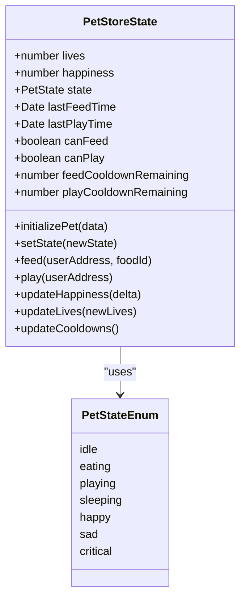
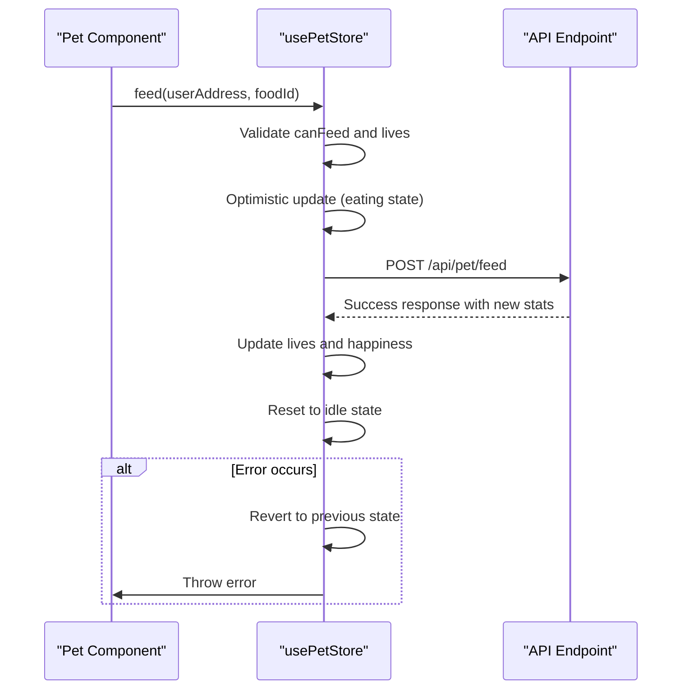
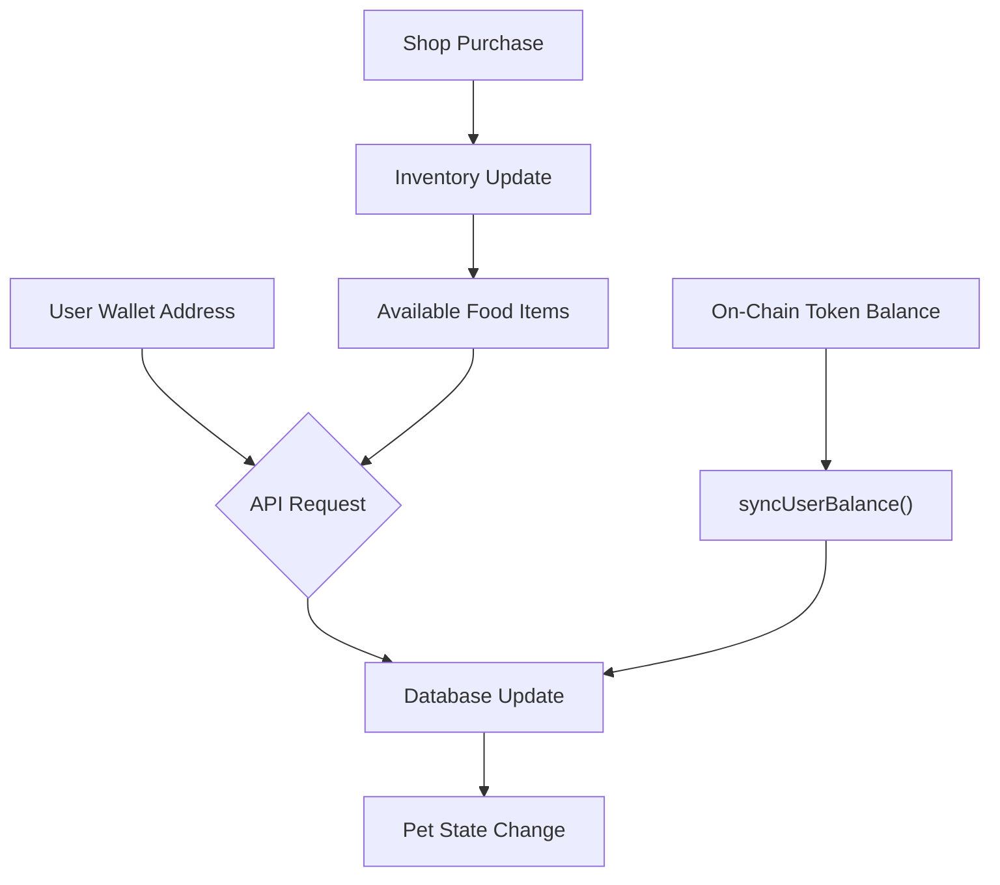
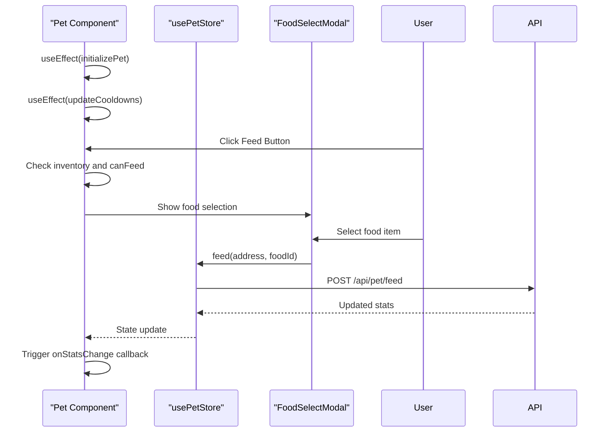
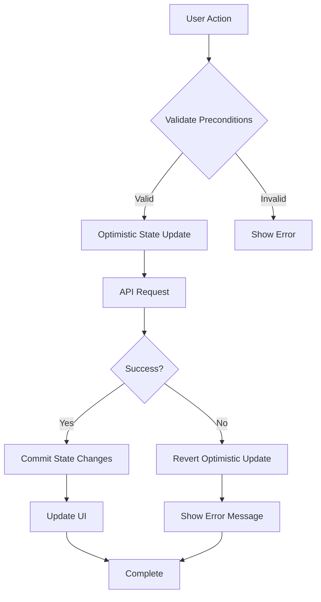

# Pet State Management

<cite>
**Referenced Files in This Document**   
- [petStore.ts](file://lib/stores/petStore.ts)
- [Pet.tsx](file://components/Pet.tsx)
- [feed/route.ts](file://app/api/pet/feed/route.ts)
- [play/route.ts](file://app/api/pet/play/route.ts)
- [blockchain.ts](file://lib/blockchain.ts)
</cite>

## Table of Contents
1. [Introduction](#introduction)
2. [Core Pet Attributes and State Management](#core-pet-attributes-and-state-management)
3. [Zustand Store Architecture](#zustand-store-architecture)
4. [Blockchain Integration and Token Influence](#blockchain-integration-and-token-influence)
5. [UI Component Integration and State Subscription](#ui-component-integration-and-state-subscription)
6. [Persistence and Rehydration Mechanisms](#persistence-and-rehydration-mechanisms)
7. [Performance Optimization Strategies](#performance-optimization-strategies)
8. [Error Handling and API Synchronization](#error-handling-and-api-synchronization)
9. [Troubleshooting Common Issues](#troubleshooting-common-issues)
10. [Conclusion](#conclusion)

## Introduction
The pet state management system in DiaryBeast implements a comprehensive Zustand-based store (`usePetStore`) that tracks and manages the core attributes of a virtual pet. This system handles health (lives), happiness, animation states, inventory interactions, and cooldown mechanics while integrating with blockchain data through the user's wallet address. The store enables real-time UI updates, supports optimistic updates with rollback capabilities, and synchronizes with backend APIs to reflect on-chain token balances that influence pet evolution and status. This document details the architecture, implementation, and integration points of this state management system.

**Section sources**
- [petStore.ts](file://lib/stores/petStore.ts#L1-L235)

## Core Pet Attributes and State Management
The pet state system manages several core attributes that define the pet's condition and behavior:

- **Lives (Health)**: Ranges from 0 to 7, representing the pet's health status. At 0 lives, the pet enters a critical state.
- **Happiness**: Ranges from 0 to 100, influencing the pet's emotional state and animation behavior.
- **Animation State**: Represents the current visual state (idle, eating, playing, sleeping, happy, sad, critical).
- **Cooldown Timers**: Tracks time since last feed and play actions to enforce gameplay mechanics.

The system uses computed properties to determine actionable states:
- `canFeed`: Indicates whether the 8-hour feed cooldown has expired
- `canPlay`: Indicates whether the 4-hour play cooldown has expired
- Cooldown remaining time in milliseconds for UI display

These attributes are managed within the Zustand store, which provides methods to update each property while enforcing business rules and boundaries.

**Diagram sources**
- [petStore.ts](file://lib/stores/petStore.ts#L15-L52)

**Section sources**
- [petStore.ts](file://lib/stores/petStore.ts#L15-L52)

## Zustand Store Architecture
The `usePetStore` implementation follows a structured architecture that separates concerns between state management, business logic, and side effects. The store is initialized with default values and provides a comprehensive API for state manipulation.

Key architectural features include:
- **State Initialization**: The `initializePet` method syncs the store with server-provided data, converting string timestamps to Date objects and triggering cooldown calculations.
- **Optimistic Updates**: Actions like feeding and playing immediately update the local state before API confirmation, providing instant UI feedback.
- **Error Rollback**: Failed operations automatically revert state changes to maintain consistency.
- **Computed State**: Cooldown status is calculated based on timestamp comparisons rather than stored directly.

The store enforces validation rules:
- Prevents feeding when at maximum lives
- Blocks actions during cooldown periods
- Ensures values remain within defined boundaries (0-7 lives, 0-100 happiness)

**Diagram sources**
- [petStore.ts](file://lib/stores/petStore.ts#L95-L220)

**Section sources**
- [petStore.ts](file://lib/stores/petStore.ts#L54-L220)

## Blockchain Integration and Token Influence
The pet state system integrates with blockchain data through the user's wallet address, creating a bridge between on-chain token balances and pet status. This integration occurs through several mechanisms:

- **Wallet Address Binding**: All pet actions require the user's wallet address, linking state changes to specific blockchain identities.
- **Token Balance Synchronization**: The `syncUserBalance` function in `blockchain.ts` updates the user's coin balance in the database based on on-chain data.
- **Inventory Management**: Food items in the pet's inventory are acquired through token-based purchases, creating an economic layer for pet care.

While the current implementation shows token burning capability in `burnTokens()`, the feed action does not currently burn tokens, indicating that costs are handled during the initial purchase rather than consumption. The system is designed to support token-gated evolution mechanics where specific token thresholds could unlock pet transformations or special abilities.

**Diagram sources**
- [blockchain.ts](file://lib/blockchain.ts#L85-L112)
- [feed/route.ts](file://app/api/pet/feed/route.ts#L1-L128)

**Section sources**
- [blockchain.ts](file://lib/blockchain.ts#L0-L112)
- [feed/route.ts](file://app/api/pet/feed/route.ts#L1-L128)

## UI Component Integration and State Subscription
The `Pet.tsx` component demonstrates how UI elements subscribe to pet state changes and trigger actions. This integration follows React best practices for state management and user interaction.

Key integration patterns include:
- **Store Subscription**: The component uses `usePetStore()` to access the global pet state, automatically re-rendering when relevant state changes.
- **Effect-Driven Updates**: `useEffect` hooks synchronize the store with component props and update cooldowns periodically.
- **Action Delegation**: UI events (button clicks) trigger store actions with proper parameter passing.

The component implements a sophisticated animation state priority system:
1. Action states (eating/playing) from store
2. Critical state (0 lives)
3. Music playback state
4. Sleep state
5. Mood-based states (happiness + lives)
6. Idle state (default)

This ensures that temporary actions take precedence over persistent emotional states.

**Diagram sources**
- [Pet.tsx](file://components/Pet.tsx#L42-L191)

**Section sources**
- [Pet.tsx](file://components/Pet.tsx#L1-L388)

## Persistence and Rehydration Mechanisms
The system implements state persistence through a combination of server-side storage and client-side rehydration:

- **Server-Side Persistence**: User pet state (lives, happiness, timestamps) is stored in the database via Prisma ORM.
- **Client-Side Rehydration**: The `initializePet` method loads server data into the Zustand store on component mount or data change.
- **Automatic Cooldown Calculation**: The `updateCooldowns` method runs every minute to recalculate actionable states based on stored timestamps.

The rehydration process converts string timestamps from the server into Date objects and immediately updates cooldown status. This ensures that state remains consistent across page reloads and device changes. The system does not appear to use localStorage for offline persistence, relying instead on server state as the source of truth.

**Section sources**
- [petStore.ts](file://lib/stores/petStore.ts#L60-L70)
- [Pet.tsx](file://components/Pet.tsx#L115-L122)

## Performance Optimization Strategies
The implementation includes several performance optimizations to ensure smooth operation:

- **Selective State Subscription**: Components subscribe only to the Zustand store, avoiding unnecessary re-renders from global state changes.
- **Throttled Cooldown Updates**: Cooldown status is updated every 60 seconds rather than continuously, reducing computational overhead.
- **Optimistic UI Updates**: Immediate state changes provide responsive feedback without waiting for API responses.
- **Batched State Updates**: Zustand's `set` function batches multiple state changes into a single re-render.

The system could further optimize by:
- Implementing memoized selectors to prevent re-renders when only unrelated state changes
- Debouncing rapid action attempts
- Using React.memo for pet component optimization

**Section sources**
- [petStore.ts](file://lib/stores/petStore.ts#L200-L220)
- [Pet.tsx](file://components/Pet.tsx#L124-L130)

## Error Handling and API Synchronization
The system implements robust error handling for state mutations and API synchronization:

- **Validation Checks**: Actions verify preconditions (cooldown status, max values) before execution.
- **Try-Catch Wrappers**: API calls are wrapped in try-catch blocks to handle network failures.
- **State Rollback**: Failed operations revert optimistic updates to maintain consistency.
- **User Feedback**: Errors are propagated to the UI for user notification.

API endpoints follow a consistent pattern:
- Validate user authentication and existence
- Check action preconditions (cooldowns, inventory)
- Update database state
- Return updated statistics

The `/api/pet/feed` endpoint includes inventory management, food effect calculation based on pet personality, and favorite food bonuses, while `/api/pet/play` provides a simpler happiness increase mechanism.

**Diagram sources**
- [petStore.ts](file://lib/stores/petStore.ts#L120-L155)
- [play/route.ts](file://app/api/pet/play/route.ts#L1-L75)

**Section sources**
- [petStore.ts](file://lib/stores/petStore.ts#L120-L180)
- [feed/route.ts](file://app/api/pet/feed/route.ts#L1-L128)
- [play/route.ts](file://app/api/pet/play/route.ts#L1-L75)

## Troubleshooting Common Issues
Common issues and their solutions include:

**State Desynchronization**
- **Cause**: Clock skew between client and server
- **Solution**: Ensure timestamps are synchronized; use server time for critical calculations

**Animation Glitches**
- **Cause**: Race conditions in state updates
- **Solution**: Use `setTimeout` with state checks to prevent overwriting active animations

**Cooldown Calculation Errors**
- **Cause**: Infrequent update intervals
- **Solution**: Increase update frequency or implement more precise countdowns

**Inventory Synchronization Issues**
- **Cause**: Delayed database updates
- **Solution**: Ensure inventory changes are reflected in both API response and subsequent state initialization

**Missing State Initialization**
- **Cause**: Props not passed to Pet component
- **Solution**: Verify all required props (livesRemaining, happiness, timestamps) are provided

**Section sources**
- [petStore.ts](file://lib/stores/petStore.ts#L60-L70)
- [Pet.tsx](file://components/Pet.tsx#L115-L122)

## Conclusion
The pet state management system in DiaryBeast provides a robust foundation for virtual pet interactions, combining client-side state management with server-side persistence and blockchain integration. The Zustand-based `usePetStore` effectively manages core attributes, enforces gameplay rules, and provides a clean API for UI components. The system's optimistic update pattern with rollback capabilities ensures a responsive user experience while maintaining data consistency. Future enhancements could include localStorage persistence for offline scenarios, more sophisticated pet evolution mechanics based on token holdings, and enhanced performance optimizations through memoized selectors.