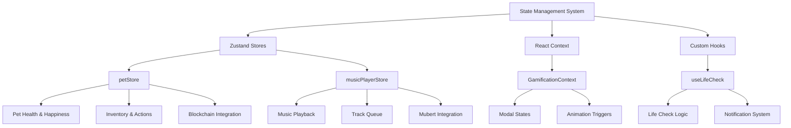
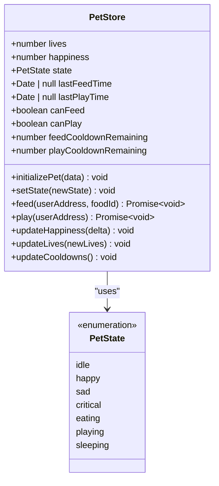
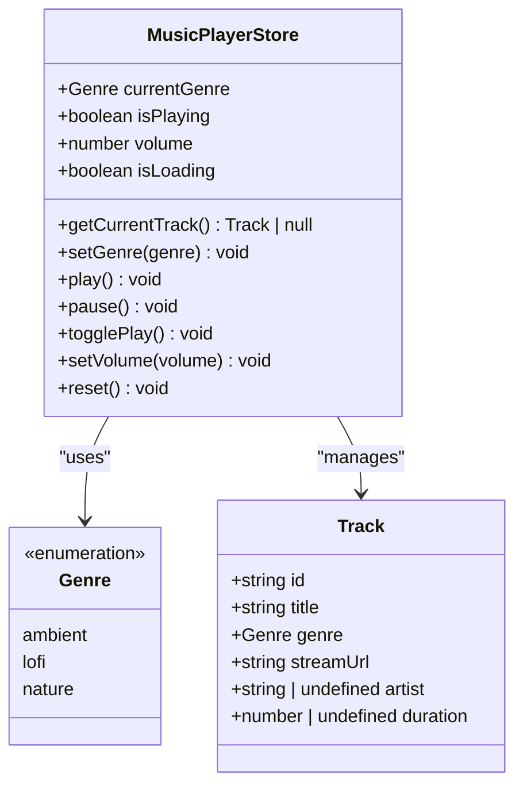
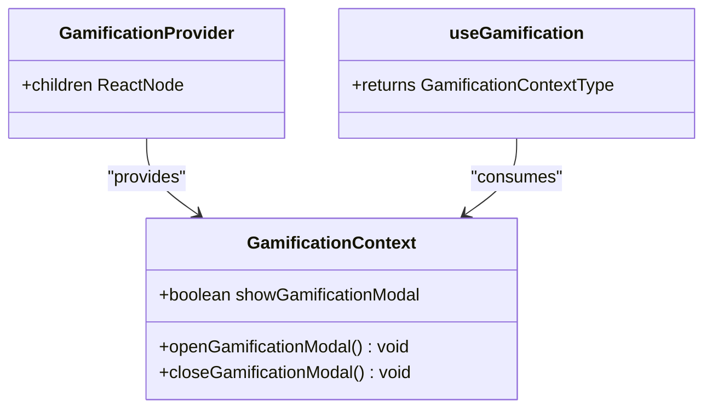
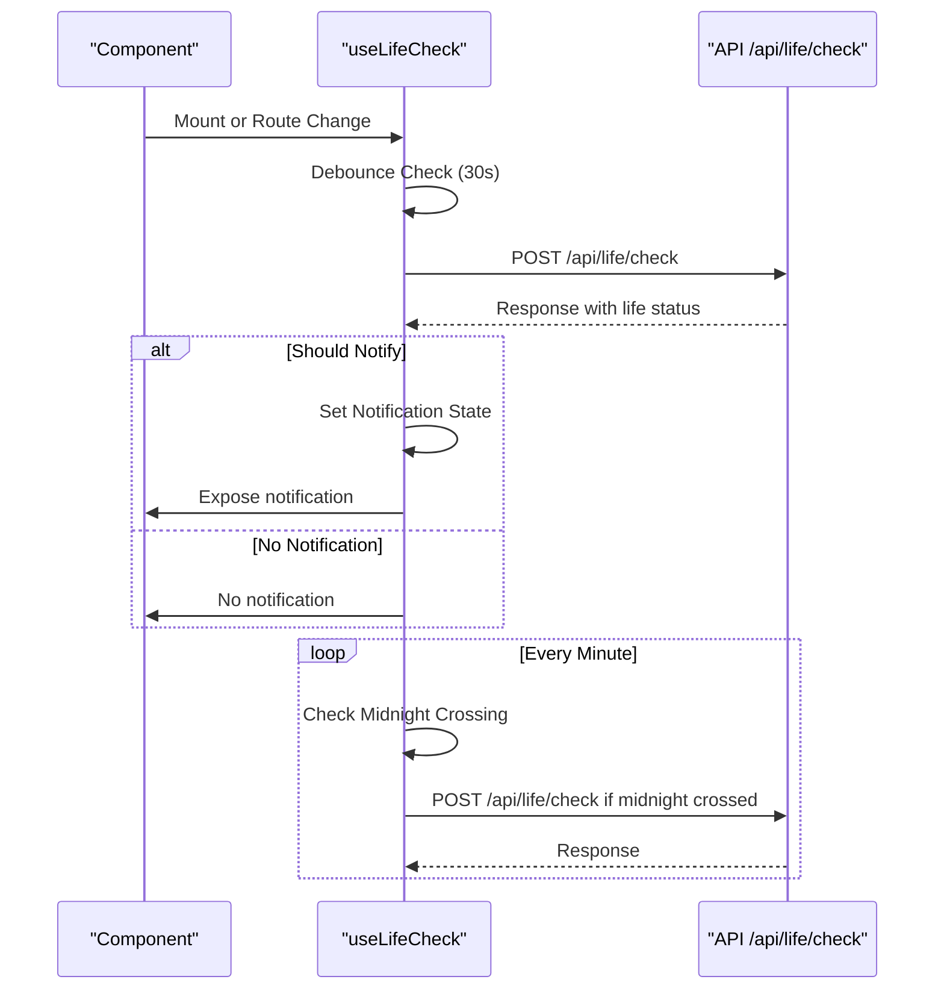
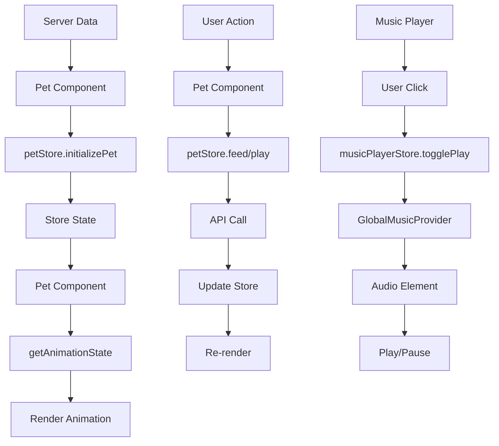
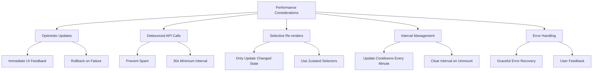

# State Management

<cite>
**Referenced Files in This Document**   
- [petStore.ts](file://lib/stores/petStore.ts)
- [musicPlayerStore.ts](file://lib/stores/musicPlayerStore.ts)
- [GamificationContext.tsx](file://lib/contexts/GamificationContext.tsx)
- [Pet.tsx](file://components/Pet.tsx)
- [PawPlayer.tsx](file://components/GlobalMusicPlayer/PawPlayer.tsx)
- [GlobalMusicProvider.tsx](file://components/GlobalMusicPlayer/GlobalMusicProvider.tsx)
- [providers.tsx](file://app/providers.tsx)
- [useLifeCheck.ts](file://hooks/useLifeCheck.ts)
</cite>

## Table of Contents
1. [Introduction](#introduction)
2. [State Management Architecture](#state-management-architecture)
3. [Persistent State with Zustand](#persistent-state-with-zustand)
   - [Pet Store](#pet-store)
   - [Music Player Store](#music-player-store)
4. [Transient State with React Context](#transient-state-with-react-context)
   - [Gamification Context](#gamification-context)
5. [Custom Hooks for Complex Logic](#custom-hooks-for-complex-logic)
   - [useLifeCheck Hook](#uselifecheck-hook)
6. [State Synchronization and Integration](#state-synchronization-and-integration)
7. [Persistence and Rehydration](#persistence-and-rehydration)
8. [Performance Considerations](#performance-considerations)

## Introduction
DiaryBeast implements a hybrid state management system that combines Zustand for persistent application state and React Context for transient UI state. This architecture supports the core gameplay mechanics of pet care, music integration, and gamification features. The system is designed to handle both blockchain-integrated data and real-time user interactions while maintaining optimal performance and reactivity.

## State Management Architecture

**Diagram sources**
- [petStore.ts](file://lib/stores/petStore.ts)
- [musicPlayerStore.ts](file://lib/stores/musicPlayerStore.ts)
- [GamificationContext.tsx](file://lib/contexts/GamificationContext.tsx)
- [useLifeCheck.ts](file://hooks/useLifeCheck.ts)

**Section sources**
- [petStore.ts](file://lib/stores/petStore.ts)
- [musicPlayerStore.ts](file://lib/stores/musicPlayerStore.ts)
- [GamificationContext.tsx](file://lib/contexts/GamificationContext.tsx)

## Persistent State with Zustand

### Pet Store

The petStore manages the persistent state of the user's virtual pet, including health, happiness, animations, and inventory. It integrates with blockchain data through the user's wallet address and maintains state across sessions.

**Diagram sources**
- [petStore.ts](file://lib/stores/petStore.ts#L13-L40)

**Section sources**
- [petStore.ts](file://lib/stores/petStore.ts#L42-L220)
- [Pet.tsx](file://components/Pet.tsx#L24-L386)

### Music Player Store

The musicPlayerStore manages the playback state, track queue, and Mubert integration for the application's music features. It persists user preferences and maintains the current playback state.

**Diagram sources**
- [musicPlayerStore.ts](file://lib/stores/musicPlayerStore.ts#L39-L53)

**Section sources**
- [musicPlayerStore.ts](file://lib/stores/musicPlayerStore.ts#L56-L161)
- [PawPlayer.tsx](file://components/GlobalMusicPlayer/PawPlayer.tsx)
- [GlobalMusicProvider.tsx](file://components/GlobalMusicPlayer/GlobalMusicProvider.tsx)

## Transient State with React Context

### Gamification Context

The GamificationContext manages transient UI states such as modals and animations that do not require persistence across sessions. It provides a simple API for showing and hiding gamification elements.

**Diagram sources**
- [GamificationContext.tsx](file://lib/contexts/GamificationContext.tsx#L4-L8)

**Section sources**
- [GamificationContext.tsx](file://lib/contexts/GamificationContext.tsx#L10-L37)
- [providers.tsx](file://app/providers.tsx#L1-L55)

## Custom Hooks for Complex Logic

### useLifeCheck Hook

The useLifeCheck custom hook abstracts complex state logic for checking pet lives and handling notifications. It manages automatic checks, debouncing, and notification state.

**Diagram sources**
- [useLifeCheck.ts](file://hooks/useLifeCheck.ts#L1-L153)

**Section sources**
- [useLifeCheck.ts](file://hooks/useLifeCheck.ts#L1-L153)

## State Synchronization and Integration

The state management system ensures synchronization between components and stores through various mechanisms:

**Diagram sources**
- [Pet.tsx](file://components/Pet.tsx#L24-L386)
- [GlobalMusicProvider.tsx](file://components/GlobalMusicPlayer/GlobalMusicProvider.tsx)
- [PawPlayer.tsx](file://components/GlobalMusicPlayer/PawPlayer.tsx)

**Section sources**
- [Pet.tsx](file://components/Pet.tsx#L24-L386)
- [GlobalMusicProvider.tsx](file://components/GlobalMusicPlayer/GlobalMusicProvider.tsx)
- [PawPlayer.tsx](file://components/GlobalMusicPlayer/PawPlayer.tsx)

## Persistence and Rehydration

The state management system implements persistence strategies to maintain state across page reloads:

- **petStore**: Persists pet state, cooldowns, and preferences through server synchronization
- **musicPlayerStore**: Uses localStorage to persist genre and volume preferences
- **Rehydration**: On component mount, stores are initialized with server data to ensure consistency

The system handles rehydration by:
1. Initializing stores with server data on component mount
2. Loading user preferences from localStorage
3. Setting up interval updates for time-based state changes
4. Synchronizing with blockchain data via wallet address

**Section sources**
- [petStore.ts](file://lib/stores/petStore.ts#L42-L220)
- [musicPlayerStore.ts](file://lib/stores/musicPlayerStore.ts#L56-L161)
- [Pet.tsx](file://components/Pet.tsx#L24-L386)

## Performance Considerations

The state management system addresses performance through several strategies:

**Diagram sources**
- [petStore.ts](file://lib/stores/petStore.ts#L42-L220)
- [useLifeCheck.ts](file://hooks/useLifeCheck.ts#L1-L153)

**Section sources**
- [petStore.ts](file://lib/stores/petStore.ts#L42-L220)
- [useLifeCheck.ts](file://hooks/useLifeCheck.ts#L1-L153)
- [Pet.tsx](file://components/Pet.tsx#L24-L386)