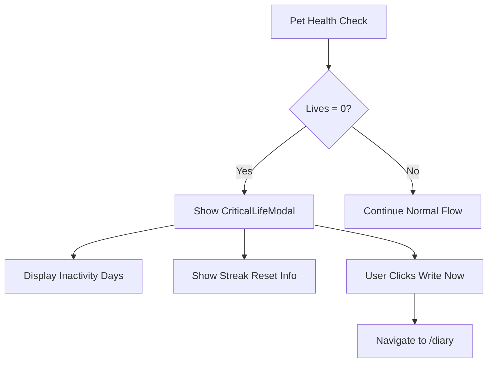
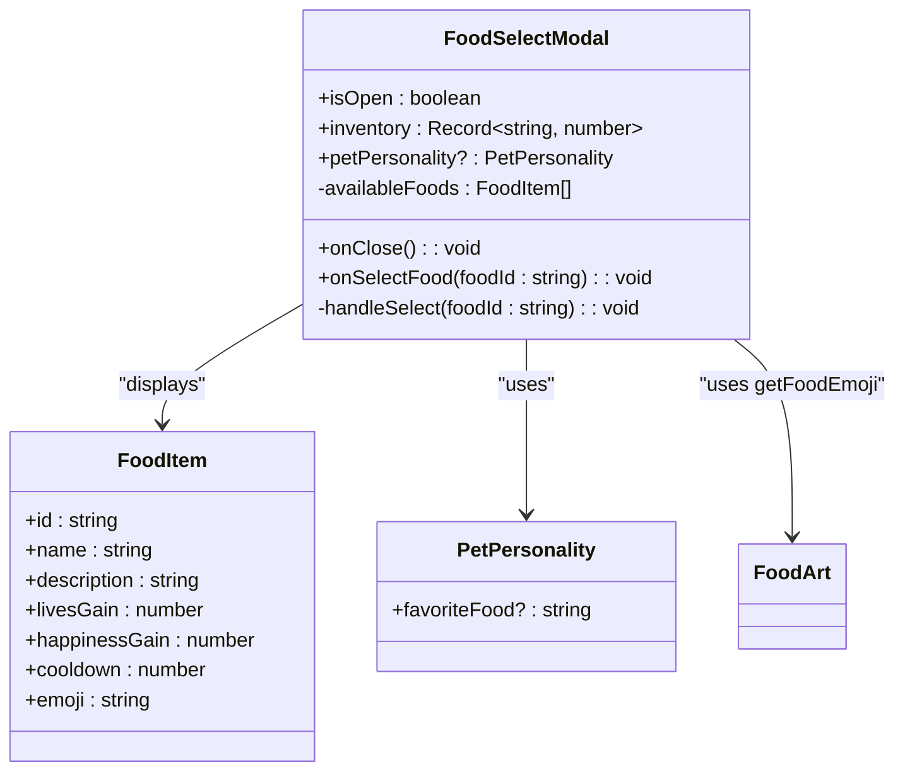
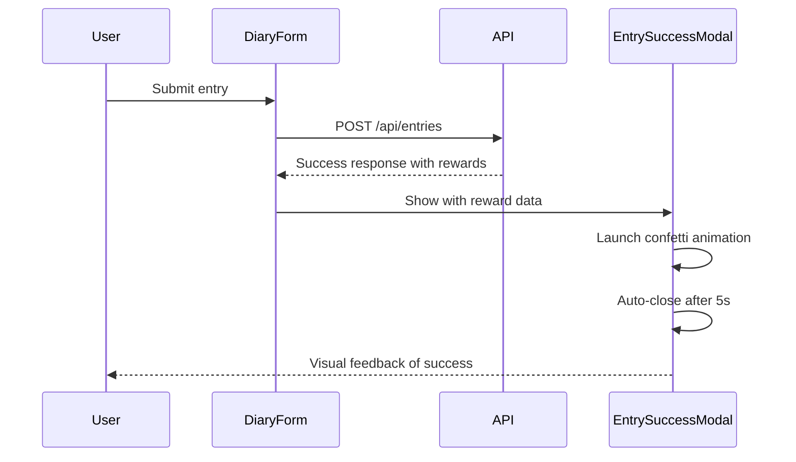
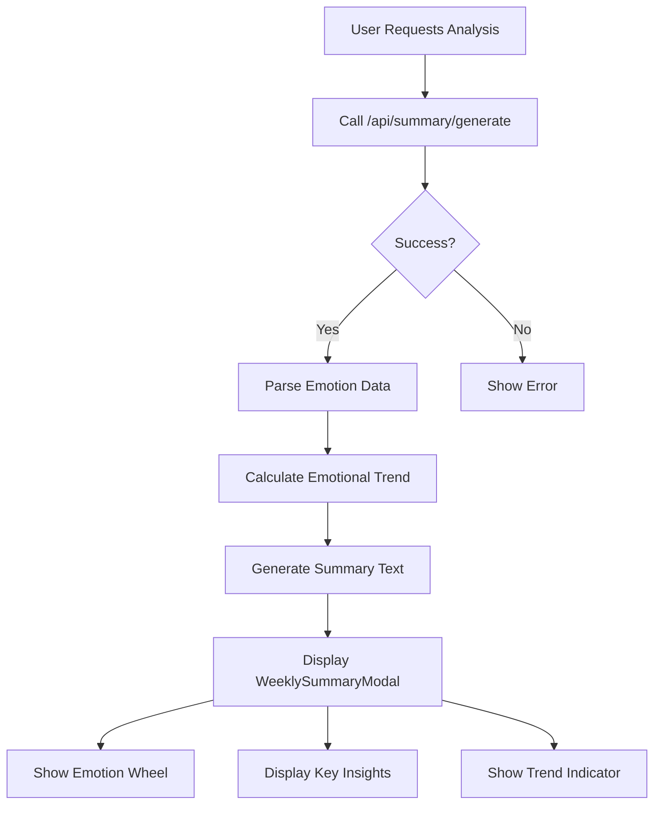
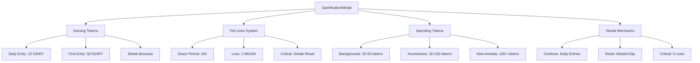
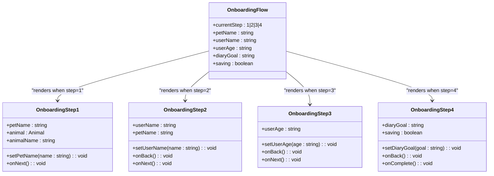

# Modal Components

<cite>
**Referenced Files in This Document**   
- [CriticalLifeModal.tsx](file://components/CriticalLifeModal.tsx)
- [FoodSelectModal.tsx](file://components/FoodSelectModal.tsx)
- [EntrySuccessModal.tsx](file://components/EntrySuccessModal.tsx)
- [WeeklySummaryModal.tsx](file://components/WeeklySummaryModal.tsx)
- [GamificationModal.tsx](file://components/GamificationModal.tsx)
- [OnboardingScreens.tsx](file://components/OnboardingScreens.tsx)
- [itemsConfig.ts](file://lib/gamification/itemsConfig.ts)
- [foodArt.ts](file://lib/ascii/foodArt.ts)
</cite>

## Table of Contents
1. [Introduction](#introduction)
2. [CriticalLifeModal](#criticallifemodal)
3. [FoodSelectModal](#foodselectmodal)
4. [EntrySuccessModal](#entrysuccessmodal)
5. [WeeklySummaryModal](#weeklysummarymodal)
6. [GamificationModal](#gamificationmodal)
7. [OnboardingScreens](#onboardingscreens)
8. [Accessibility Features](#accessibility-features)
9. [Best Practices](#best-practices)
10. [Conclusion](#conclusion)

## Introduction
This document provides comprehensive documentation for all modal components used in the DiaryBeast application. These modals serve critical functions in user engagement, gamification, and pet care mechanics. The modals are designed with accessibility, animation transitions, and integration with the gamification system in mind. Each modal receives data via props and dispatches actions upon interaction, forming a key part of the user experience.

## CriticalLifeModal
The CriticalLifeModal is displayed when a pet has lost all lives due to user inactivity. This modal creates urgency and emotional connection by blocking the UI until the user takes action to revive their pet.

### Trigger Conditions
- Displayed when pet health reaches 0 lives
- Triggered by life check system after period of inactivity
- Appears on any page navigation when condition is met

### Props
- `daysInactive`: Number of days since last user activity
- `oldStreak`: Previous streak count before reset
- `isOpen`: Boolean controlling modal visibility
- `onClose`: Optional callback function for close events

### Animation Transitions
- Fade-in animation on appearance (`animate-in fade-in duration-200`)
- Zoom-in effect for the modal content (`animate-in zoom-in duration-300`)
- Pulsing heartbreak emoji to draw attention (`animate-pulse`)

### Integration
- Integrated with gamification system through streak tracking
- Connected to pet store economy via life restoration mechanics
- Dispatches navigation to `/diary` when "Write Now" is clicked

**Diagram sources**
- [CriticalLifeModal.tsx](file://components/CriticalLifeModal.tsx#L4-L115)

**Section sources**
- [CriticalLifeModal.tsx](file://components/CriticalLifeModal.tsx#L4-L115)

## FoodSelectModal
The FoodSelectModal allows users to select food items from their inventory when feeding their pet. It displays available food with special highlighting for favorite foods.

### Trigger Conditions
- Displayed when user initiates pet feeding action
- Triggered from pet interaction interface
- Appears after selecting "Feed" option in pet care menu

### Props
- `isOpen`: Controls modal visibility
- `onClose`: Callback function for closing the modal
- `inventory`: Record of food items and quantities owned
- `onSelectFood`: Callback when food is selected
- `petPersonality`: Optional pet characteristics including favorite food

### Animation Transitions
- Fade-in backdrop animation (`animate-in fade-in duration-200`)
- Zoom-in effect for modal content (`animate-in zoom-in duration-300`)
- Scale transformation on food item hover (`hover:scale-[1.02]`)

### Integration
- Integrated with gamification system through food effects and inventory
- Connected to pet store for purchasing food items
- Uses favorite food mechanics to provide bonus effects
- Displays food emoji and ASCII art from foodArt module

**Diagram sources**
- [FoodSelectModal.tsx](file://components/FoodSelectModal.tsx#L5-L132)
- [itemsConfig.ts](file://lib/gamification/itemsConfig.ts#L13-L23)
- [foodArt.ts](file://lib/ascii/foodArt.ts#L25-L32)

**Section sources**
- [FoodSelectModal.tsx](file://components/FoodSelectModal.tsx#L5-L132)
- [itemsConfig.ts](file://lib/gamification/itemsConfig.ts#L11-L233)
- [foodArt.ts](file://lib/ascii/foodArt.ts#L1-L189)

## EntrySuccessModal
The EntrySuccessModal appears after a user successfully saves a diary entry, providing feedback on rewards earned and pet health improvements.

### Trigger Conditions
- Displayed immediately after saving a diary entry
- Triggered by successful API response from entry submission
- Appears on the diary page after form submission

### Props
- `isOpen`: Controls modal visibility
- `tokensEarned`: Number of DIARY tokens earned
- `livesRestored`: Number of lives restored (typically 2)
- `oldLives`: Pet's life count before restoration
- `newLives`: Pet's life count after restoration
- `streakBonus`: Optional bonus tokens from streak milestones
- `milestone`: Text description of streak milestone
- `baseAmount`: Base token reward amount
- `multiplier`: Reward multiplier (can be reduced for late entries)
- `multiplierReason`: Explanation for multiplier value
- `onClose`: Callback function for closing the modal

### Animation Transitions
- Confetti celebration animation using canvas-confetti library
- Auto-closing after 5 seconds
- Fade-in backdrop (`animate-in fade-in duration-200`)
- Zoom-in effect for modal content (`animate-in zoom-in duration-300`)
- Bouncing celebration emoji (`animate-bounce`)

### Integration
- Integrated with gamification system through token rewards and streak tracking
- Connected to pet health system via life restoration
- Uses confetti animation to celebrate user achievements
- Automatically closes to maintain user flow

**Diagram sources**
- [EntrySuccessModal.tsx](file://components/EntrySuccessModal.tsx#L30-L245)

**Section sources**
- [EntrySuccessModal.tsx](file://components/EntrySuccessModal.tsx#L30-L245)

## WeeklySummaryModal
The WeeklySummaryModal provides users with a comprehensive analysis of their emotional journey over the past week, using Plutchik's emotion wheel model.

### Trigger Conditions
- Displayed when user requests weekly analysis
- Triggered from insights or profile page
- Appears after successful API call to summary generation endpoint

### Props
- `isOpen`: Controls modal visibility
- `onClose`: Callback function for closing the modal
- `weekLabel`: Text description of the week period
- `emotions`: Object containing Plutchik emotion intensities
- `summary`: Text summary of the week's emotional journey
- `insights`: Array of key insights from the analysis
- `trend`: Emotional trend classification (improving, stable, declining)
- `newBalance`: Optional updated token balance after analysis cost

### Animation Transitions
- Simple fade-in effect with black backdrop
- Sticky header and footer for long content
- Smooth width transition for emotion bars (`transition-all duration-300`)

### Integration
- Integrated with AI analysis system for emotion detection
- Connected to token economy with 50 DIARY cost for analysis
- Uses Plutchik's emotion wheel model for visualization
- Displays emotional trend with appropriate emoji and color coding

**Diagram sources**
- [WeeklySummaryModal.tsx](file://components/WeeklySummaryModal.tsx#L41-L196)

**Section sources**
- [WeeklySummaryModal.tsx](file://components/WeeklySummaryModal.tsx#L2-L196)

## GamificationModal
The GamificationModal serves as an educational guide that explains the game mechanics, token economy, and pet care system to users.

### Trigger Conditions
- Displayed when user accesses help or tutorial section
- Triggered from navigation menu or onboarding flow
- Appears when user clicks "How It Works" button

### Props
- `isOpen`: Controls modal visibility
- `onClose`: Callback function for closing the modal

### Animation Transitions
- Simple fade-in with black backdrop
- Sticky header and footer for scrolling content
- No complex animations, focused on information delivery

### Integration
- Integrated with the entire gamification system
- Explains token earning mechanics (daily entries, streaks)
- Details pet lives system and consequences of inactivity
- Describes token spending options in the pet store
- Explains streak mechanics and reset conditions

**Diagram sources**
- [GamificationModal.tsx](file://components/GamificationModal.tsx#L7-L277)

**Section sources**
- [GamificationModal.tsx](file://components/GamificationModal.tsx#L7-L277)

## OnboardingScreens
The OnboardingScreens component consists of a multi-step modal flow that guides new users through the initial setup process, collecting essential information and setting up their pet companion.

### Structure
The onboarding flow consists of four sequential steps:

1. **Pet Naming**: User names their assigned pet
2. **User Information**: User provides their name
3. **Age Selection**: User selects their age group
4. **Goal Setting**: User chooses their primary journaling goal

### State Persistence
- State is maintained through React useState hooks
- Data is preserved as user navigates between steps
- Information is saved only upon completion of all steps
- Back navigation preserves previously entered data

### Completion Handling
- Final step validates that a goal has been selected
- Shows loading state during save operation
- Dispatches completion callback when journey begins
- Integrates with wallet system for persistent user identity

### Props by Step

#### OnboardingStep1
- `petName`: Current pet name input
- `setPetName`: Function to update pet name
- `onNext`: Callback for proceeding to next step
- `animal`: Pet type (cat/dog)
- `animalName`: Display name of pet type

#### OnboardingStep2
- `userName`: Current user name input
- `setUserName`: Function to update user name
- `onBack`: Callback for returning to previous step
- `onNext`: Callback for proceeding to next step
- `petName`: Name of the user's pet

#### OnboardingStep3
- `userAge`: Selected age group
- `setUserAge`: Function to update age selection
- `onBack`: Callback for returning to previous step
- `onNext`: Callback for proceeding to next step

#### OnboardingStep4
- `diaryGoal`: Selected journaling goal
- `setDiaryGoal`: Function to update goal selection
- `onBack`: Callback for returning to previous step
- `onComplete`: Callback for completing onboarding
- `saving`: Boolean indicating save operation status

**Diagram sources**
- [OnboardingScreens.tsx](file://components/OnboardingScreens.tsx#L8-L270)

**Section sources**
- [OnboardingScreens.tsx](file://components/OnboardingScreens.tsx#L8-L270)

## Accessibility Features
All modal components implement comprehensive accessibility features to ensure usability for all users.

### Focus Trapping
- Modals trap focus within their content
- Keyboard navigation cycles through interactive elements
- Close buttons and actions are reachable via keyboard
- Focus returns to triggering element when modal closes

### ARIA Roles
- Proper ARIA roles for dialog elements (`role="dialog"`)
- Accessible labels for all interactive elements
- Status messages for screen readers
- Semantic HTML structure with appropriate heading hierarchy

### Keyboard Navigation
- Tab navigation through all interactive elements
- Escape key closes modals
- Enter/Space activate buttons and links
- Full keyboard operability without mouse requirement

### Visual Accessibility
- High contrast text and background colors
- Sufficient font sizes for readability
- Clear visual indicators for interactive elements
- Alternative text for all meaningful images and icons

## Best Practices
This section outlines best practices for modal usage and implementation in the application.

### Modal Stacking
- Avoid stacking multiple modals when possible
- If stacking is necessary, ensure clear visual hierarchy
- Top modal should have highest z-index and capture all interactions
- Background modals should be visually dimmed and non-interactive

### Preventing UI Blocking
- Only CriticalLifeModal should completely block UI
- Other modals should allow dismissal via backdrop click or escape key
- Long-running operations should show progress instead of blocking
- Provide clear exit paths from all modal states

### Performance Considerations
- Unmount modal components when not visible
- Use React.memo for modal components to prevent unnecessary re-renders
- Lazy load modal content when appropriate
- Optimize animations for smooth 60fps performance

### Responsive Design
- Modals adapt to different screen sizes
- Maximum width constraints for large screens
- Full-height scrolling for long content on mobile
- Touch-friendly tap targets for mobile devices

## Conclusion
The modal components in DiaryBeast play a crucial role in user engagement, gamification, and pet care mechanics. Each modal is carefully designed with specific trigger conditions, animation transitions, and integration points with the broader system. The components follow accessibility best practices and provide clear feedback to users. The onboarding flow guides new users through setup with state persistence, while the various feedback modals reinforce positive behaviors and provide educational content about the gamification system. By following the documented best practices, developers can ensure consistent and effective modal usage throughout the application.