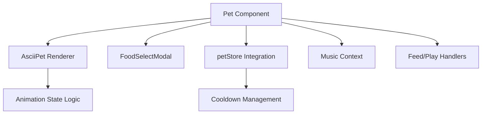
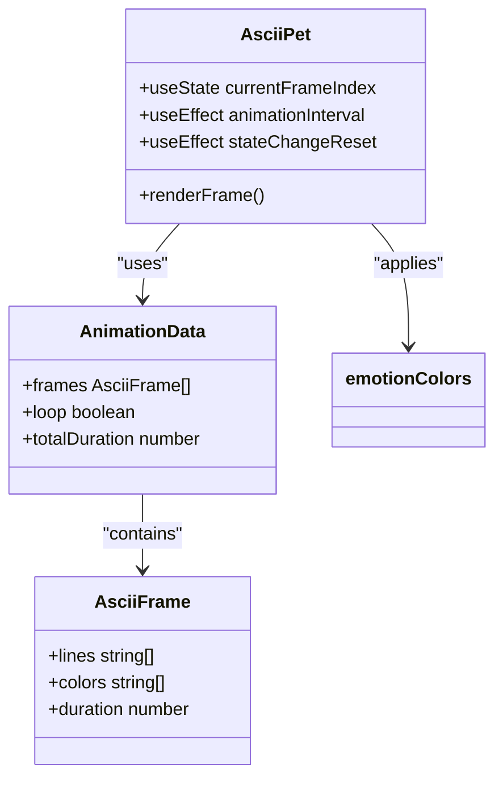
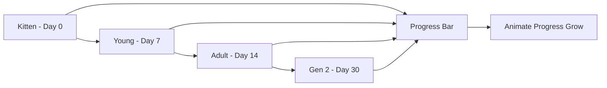
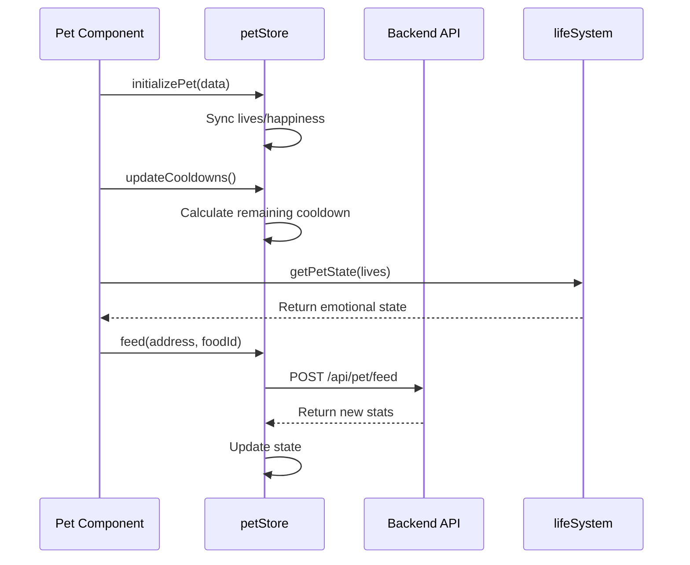
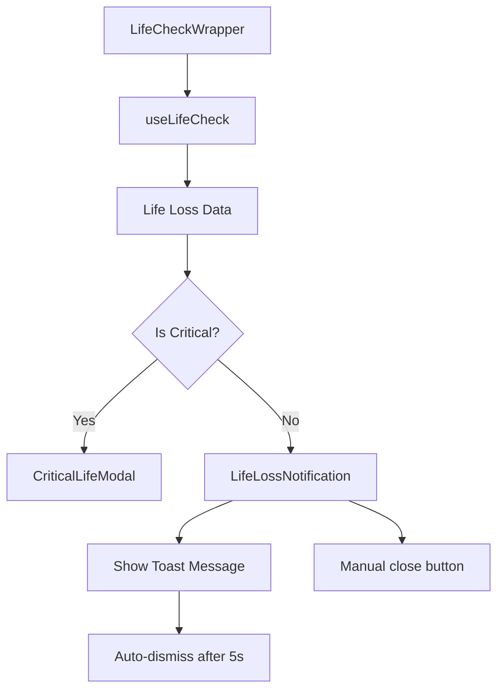

# Pet Components

<cite>
**Referenced Files in This Document**   
- [Pet.tsx](file://components/Pet.tsx)
- [AsciiPet.tsx](file://components/AsciiPet.tsx)
- [PetEvolution.tsx](file://components/PetEvolution.tsx)
- [LifeCheckWrapper.tsx](file://components/LifeCheckWrapper.tsx)
- [LifeLossNotification.tsx](file://components/LifeLossNotification.tsx)
- [petStore.ts](file://lib/stores/petStore.ts)
- [lifeSystem.ts](file://lib/gamification/lifeSystem.ts)
- [types.ts](file://lib/ascii/types.ts)
- [catAnimations.ts](file://lib/ascii/catAnimations.ts)
- [dogAnimations.ts](file://lib/ascii/dogAnimations.ts)
</cite>

## Table of Contents
1. [Introduction](#introduction)
2. [Core Components Overview](#core-components-overview)
3. [Pet Component Architecture](#pet-component-architecture)
4. [AsciiPet Animation System](#asciipet-animation-system)
5. [Pet Evolution Visualization](#pet-evolution-visualization)
6. [State Management and Integration](#state-management-and-integration)
7. [Health Monitoring and Feedback](#health-monitoring-and-feedback)
8. [Performance and Accessibility](#performance-and-accessibility)
9. [Conclusion](#conclusion)

## Introduction
The DiaryBeast pet system features a collection of interactive UI components centered around pet interaction, animation, and growth visualization. These components work together to create an engaging tamagotchi-style experience where users can feed, play with, and monitor their virtual pets. The system integrates real-time state management with visual feedback mechanisms to create a responsive and immersive user experience.

## Core Components Overview
The pet UI system consists of three primary components: Pet.tsx as the main container, AsciiPet.tsx for rendering animated ASCII art, and PetEvolution.tsx for visualizing pet growth stages. These components work in concert with supporting utilities like LifeCheckWrapper and LifeLossNotification to provide comprehensive pet interaction and feedback.

**Section sources**
- [Pet.tsx](file://components/Pet.tsx#L24-L386)
- [AsciiPet.tsx](file://components/AsciiPet.tsx#L12-L58)
- [PetEvolution.tsx](file://components/PetEvolution.tsx#L41-L113)

## Pet Component Architecture
The Pet component serves as the primary container for pet interaction, managing state, animations, and user actions. It accepts key props including petType (cat/dog), mood, health status, and inventory data to customize the pet experience.

**Diagram sources**
- [Pet.tsx](file://components/Pet.tsx#L24-L386)
- [petStore.ts](file://lib/stores/petStore.ts#L1-L234)

**Section sources**
- [Pet.tsx](file://components/Pet.tsx#L24-L386)
- [petStore.ts](file://lib/stores/petStore.ts#L1-L234)

## AsciiPet Animation System
The AsciiPet component renders animated ASCII art of cats and dogs using frame-based animation. It manages animation state transitions and frame rendering with optimized performance for frequent updates.

**Diagram sources**
- [AsciiPet.tsx](file://components/AsciiPet.tsx#L12-L58)
- [types.ts](file://lib/ascii/types.ts#L1-L149)
- [catAnimations.ts](file://lib/ascii/catAnimations.ts#L1-L417)
- [dogAnimations.ts](file://lib/ascii/dogAnimations.ts#L1-L273)

**Section sources**
- [AsciiPet.tsx](file://components/AsciiPet.tsx#L12-L58)
- [types.ts](file://lib/ascii/types.ts#L1-L149)

## Pet Evolution Visualization
The PetEvolution component visualizes pet growth stages through a timeline interface that shows progression from kitten/young stages to adult and generation 2 forms. It provides visual feedback on pet development milestones.

**Diagram sources**
- [PetEvolution.tsx](file://components/PetEvolution.tsx#L41-L113)
- [AsciiPet.tsx](file://components/AsciiPet.tsx#L12-L58)

**Section sources**
- [PetEvolution.tsx](file://components/PetEvolution.tsx#L41-L113)

## State Management and Integration
The pet system integrates with petStore and lifeSystem for real-time state updates. The petStore manages core pet statistics and action cooldowns, while the lifeSystem determines emotional states based on health metrics.

**Diagram sources**
- [Pet.tsx](file://components/Pet.tsx#L24-L386)
- [petStore.ts](file://lib/stores/petStore.ts#L1-L234)
- [lifeSystem.ts](file://lib/gamification/lifeSystem.ts#L1-L345)

**Section sources**
- [petStore.ts](file://lib/stores/petStore.ts#L1-L234)
- [lifeSystem.ts](file://lib/gamification/lifeSystem.ts#L1-L345)

## Health Monitoring and Feedback
The LifeCheckWrapper and LifeLossNotification components provide contextual UI feedback based on pet health thresholds. They integrate with the life system to display appropriate notifications when pet health changes.

**Diagram sources**
- [LifeCheckWrapper.tsx](file://components/LifeCheckWrapper.tsx#L20-L58)
- [LifeLossNotification.tsx](file://components/LifeLossNotification.tsx#L22-L99)

**Section sources**
- [LifeCheckWrapper.tsx](file://components/LifeCheckWrapper.tsx#L20-L58)
- [LifeLossNotification.tsx](file://components/LifeLossNotification.tsx#L22-L99)

## Performance and Accessibility
The pet components implement several performance optimizations for rendering frequent ASCII frame updates and consider accessibility for animated content. The animation system uses efficient state management and frame rendering techniques to maintain smooth performance.

**Section sources**
- [AsciiPet.tsx](file://components/AsciiPet.tsx#L12-L58)
- [Pet.tsx](file://components/Pet.tsx#L24-L386)

## Conclusion
The DiaryBeast pet components create an engaging and responsive virtual pet experience through a combination of animated ASCII art, real-time state management, and visual feedback systems. The architecture effectively separates concerns between rendering, state management, and user interaction while maintaining performance and accessibility standards. The integration between petStore, lifeSystem, and UI components creates a cohesive experience that responds dynamically to user actions and pet health metrics.