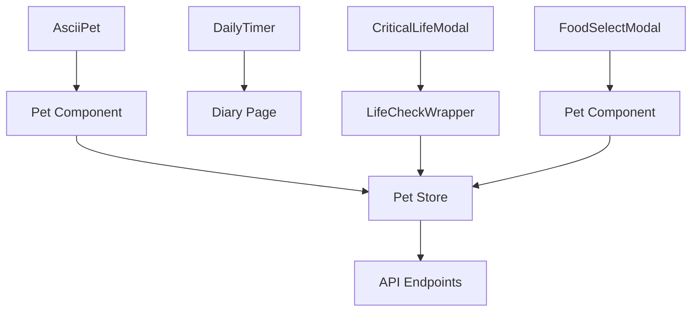
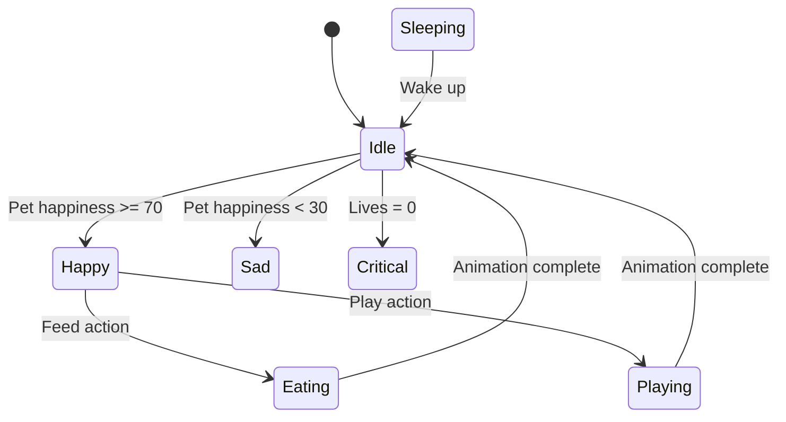
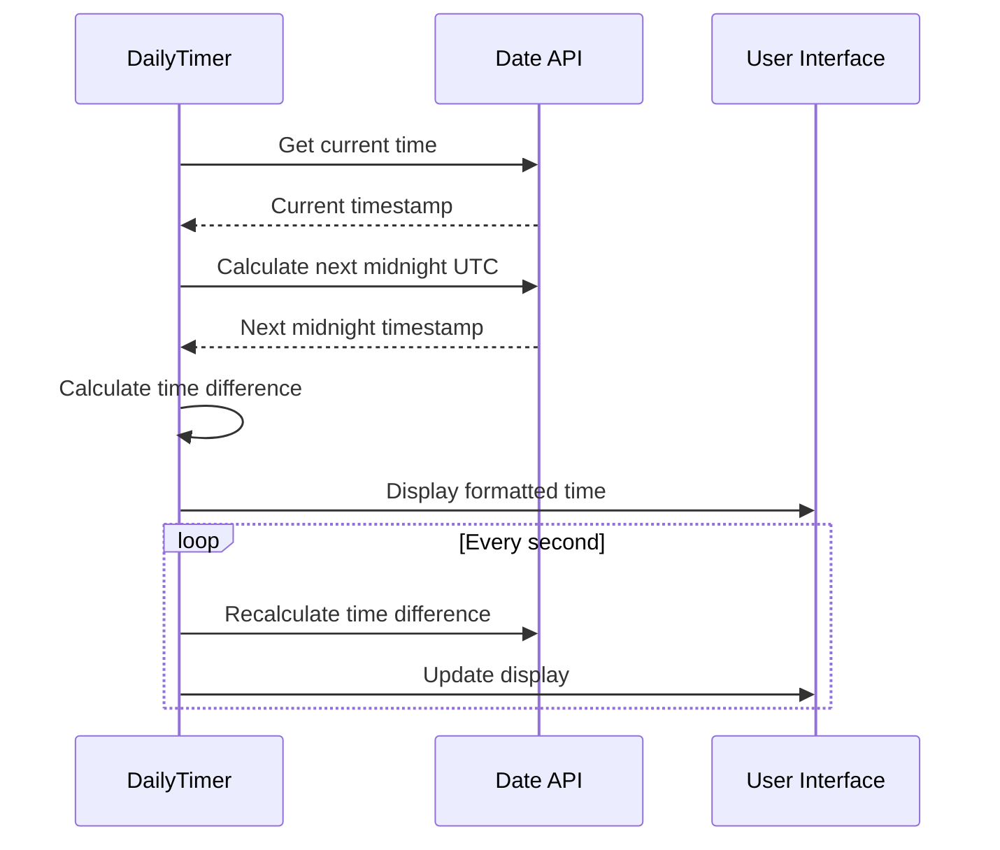
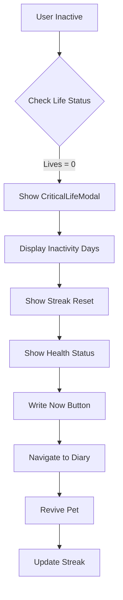
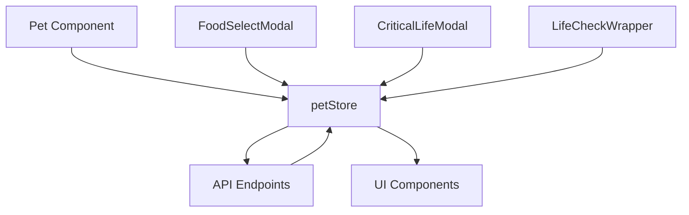
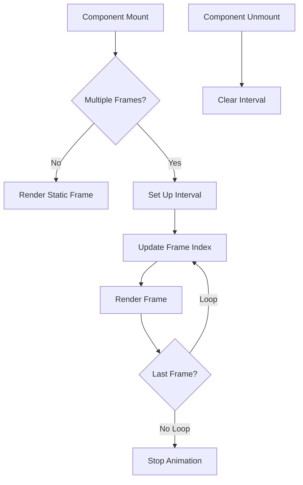

# UI Components Library

<cite>
**Referenced Files in This Document**   
- [AsciiPet.tsx](file://components/AsciiPet.tsx)
- [AsciiPet.stories.tsx](file://components/AsciiPet.stories.tsx)
- [DailyTimer.tsx](file://components/DailyTimer.tsx)
- [DailyTimer.stories.tsx](file://components/DailyTimer.stories.tsx)
- [CriticalLifeModal.tsx](file://components/CriticalLifeModal.tsx)
- [CriticalLifeModal.stories.tsx](file://components/CriticalLifeModal.stories.tsx)
- [FoodSelectModal.tsx](file://components/FoodSelectModal.tsx)
- [Pet.tsx](file://components/Pet.tsx)
- [lib/ascii/types.ts](file://lib/ascii/types.ts)
- [lib/ascii/catAnimations.ts](file://lib/ascii/catAnimations.ts)
- [lib/ascii/dogAnimations.ts](file://lib/ascii/dogAnimations.ts)
- [lib/ascii/foodArt.ts](file://lib/ascii/foodArt.ts)
- [lib/stores/petStore.ts](file://lib/stores/petStore.ts)
- [lib/gamification/lifeSystem.ts](file://lib/gamification/lifeSystem.ts)
- [lib/gamification/itemsConfig.ts](file://lib/gamification/itemsConfig.ts)
</cite>

## Table of Contents
1. [Introduction](#introduction)
2. [Component Overview](#component-overview)
3. [AsciiPet Component](#asciipet-component)
4. [DailyTimer Component](#dailytimer-component)
5. [CriticalLifeModal Component](#criticallifemodal-component)
6. [FoodSelectModal Component](#foodselectmodal-component)
7. [Component Composition and State Management](#component-composition-and-state-management)
8. [Storybook Integration](#storybook-integration)
9. [Responsive Design and Accessibility](#responsive-design-and-accessibility)
10. [Theming with Tailwind CSS](#theming-with-tailwind-css)
11. [Performance Optimization](#performance-optimization)
12. [Conclusion](#conclusion)

## Introduction
The DiaryBeast UI Components Library provides a collection of interactive components that enhance user engagement through gamification. These components are designed with a retro Tamagotchi-inspired aesthetic, featuring animated ASCII art pets, time-based challenges, and modal interactions that create an emotional connection with users. The library emphasizes visual feedback, responsive interactions, and seamless integration with Storybook for visual testing and documentation.

The components are built using React with TypeScript, leveraging modern React patterns including hooks, context, and state management. They are styled with Tailwind CSS for consistent theming and responsive behavior across devices. The library follows accessibility best practices with proper ARIA labels, keyboard navigation support, and semantic HTML structure.

**Section sources**
- [components/AsciiPet.tsx](file://components/AsciiPet.tsx#L1-L60)
- [components/DailyTimer.tsx](file://components/DailyTimer.tsx#L1-L86)
- [components/CriticalLifeModal.tsx](file://components/CriticalLifeModal.tsx#L1-L117)
- [components/FoodSelectModal.tsx](file://components/FoodSelectModal.tsx#L1-L134)

## Component Overview
The UI components library consists of four primary components that work together to create an engaging user experience:

- **AsciiPet**: Renders animated virtual pets using ASCII art with different emotional states and life stages
- **DailyTimer**: Displays a countdown timer showing time remaining until the next diary entry deadline
- **CriticalLifeModal**: Shows an alert when the pet's health is critically low or depleted
- **FoodSelectModal**: Provides an interface for feeding the pet with items from inventory

These components are designed to work together within the DiaryBeast application, creating a cohesive gamification system that encourages regular user engagement. The components are highly customizable through props and support theming via Tailwind CSS utility classes.



**Diagram sources**
- [components/AsciiPet.tsx](file://components/AsciiPet.tsx#L1-L60)
- [components/Pet.tsx](file://components/Pet.tsx#L1-L388)
- [components/LifeCheckWrapper.tsx](file://components/LifeCheckWrapper.tsx#L1-L60)
- [lib/stores/petStore.ts](file://lib/stores/petStore.ts#L1-L235)

## AsciiPet Component

The AsciiPet component renders animated virtual pets using ASCII art with different emotional states and life stages. It supports both cat and dog characters with distinct animations for various states including idle, happy, sad, critical, eating, playing, and sleeping.

### Props
The component accepts the following props:

| Prop | Type | Required | Description |
|------|------|----------|-------------|
| animal | "cat" \| "dog" | Yes | Specifies the type of pet to display |
| state | PetState | Yes | Current emotional/action state of the pet |
| className | string | No | Additional CSS classes to apply to the component |

The PetState type includes: idle, happy, sad, critical, eating, playing, sleeping, kitten, young, adult, gen2.

### Animation System
The AsciiPet component uses a frame-based animation system with configurable frame durations and loop behavior. Each animation state consists of multiple frames that are cycled through at specified intervals. The animation speed and behavior are defined in the animation configuration files.



**Diagram sources**
- [components/AsciiPet.tsx](file://components/AsciiPet.tsx#L12-L58)
- [lib/ascii/types.ts](file://lib/ascii/types.ts#L1-L150)
- [lib/ascii/catAnimations.ts](file://lib/ascii/catAnimations.ts#L1-L418)
- [lib/ascii/dogAnimations.ts](file://lib/ascii/dogAnimations.ts#L1-L274)

### Customization Options
The AsciiPet component can be customized through several mechanisms:

1. **Color Themes**: The component uses Tailwind CSS classes to define color palettes for different emotional states. These can be overridden with custom classes passed through the className prop.

2. **Animation Speed**: The animation speed is controlled by the duration property of each frame in the animation configuration. This can be modified in the animation files.

3. **Size and Layout**: The component's size can be adjusted using Tailwind's sizing utilities (e.g., h-24, text-sm) passed through the className prop.

4. **State Mapping**: The component supports custom state mapping by extending the PetState type and adding corresponding animations.

**Section sources**
- [components/AsciiPet.tsx](file://components/AsciiPet.tsx#L1-L60)
- [lib/ascii/types.ts](file://lib/ascii/types.ts#L1-L150)
- [lib/ascii/catAnimations.ts](file://lib/ascii/catAnimations.ts#L1-L418)
- [lib/ascii/dogAnimations.ts](file://lib/ascii/dogAnimations.ts#L1-L274)

## DailyTimer Component

The DailyTimer component displays a countdown timer showing the time remaining until the next diary entry deadline. It provides visual feedback based on whether the user has already written an entry today.

### Props
The component accepts a single prop:

| Prop | Type | Required | Description |
|------|------|----------|-------------|
| hasWrittenToday | boolean | Yes | Indicates whether the user has written an entry today |

### Visual States
The component has two distinct visual states:

1. **Time Remaining**: When hasWrittenToday is false, the component displays an urgent warning with a pulsing animation and clock emoji, showing the countdown to the next entry deadline.

2. **Entry Claimed**: When hasWrittenToday is true, the component displays a success message with a checkmark emoji, followed by the countdown to the next available entry.

### Implementation Details
The component uses the useEffect hook to set up a timer that updates every second. It calculates the time remaining until the next midnight UTC, which serves as the entry deadline. The time is displayed in hours, minutes, and seconds with proper zero-padding.



**Diagram sources**
- [components/DailyTimer.tsx](file://components/DailyTimer.tsx#L8-L84)
- [lib/ascii/types.ts](file://lib/ascii/types.ts#L1-L150)

### Customization Options
The DailyTimer component can be customized through the following methods:

1. **Styling**: The component's appearance can be modified using Tailwind CSS classes. The base styling uses the application's color palette with primary, success, and warning colors.

2. **Time Zone**: The component currently uses UTC for consistency across time zones. This can be modified to use the user's local time zone by changing the date calculation logic.

3. **Display Format**: The time display format can be customized by modifying the formatTime function or by passing custom formatting options.

4. **Animation**: The pulsing animation for the time remaining state can be adjusted or replaced with different animation effects.

**Section sources**
- [components/DailyTimer.tsx](file://components/DailyTimer.tsx#L1-L86)
- [components/DailyTimer.stories.tsx](file://components/DailyTimer.stories.tsx#L1-L38)

## CriticalLifeModal Component

The CriticalLifeModal component displays an alert when the pet's health is critically low or depleted. It creates urgency and emotional connection by requiring user action to revive the pet.

### Props
The component accepts the following props:

| Prop | Type | Required | Description |
|------|------|----------|-------------|
| isOpen | boolean | Yes | Controls whether the modal is visible |
| daysInactive | number | Yes | Number of days the user has been inactive |
| oldStreak | number | Yes | Previous streak count before reset |
| onClose | () => void | No | Callback function when modal is closed |

### Visual Design
The modal features a dramatic design with a black translucent backdrop and a centered card with a red border and glow effect. It includes:

- A large heartbreak emoji (💔) as the primary visual element
- Bold text with a cyan glow effect for emphasis
- Critical health indicators showing all seven hearts as broken
- A prominent "Write Now" button with hover effects

The modal cannot be dismissed without taking action, creating urgency to engage with the application.



**Diagram sources**
- [components/CriticalLifeModal.tsx](file://components/CriticalLifeModal.tsx#L22-L115)
- [lib/gamification/lifeSystem.ts](file://lib/gamification/lifeSystem.ts#L1-L346)

### Customization Options
The CriticalLifeModal component can be customized in several ways:

1. **Content**: The messaging and emojis can be modified to match different tone or branding requirements.

2. **Styling**: The color scheme, border styles, and shadow effects can be adjusted using Tailwind CSS classes.

3. **Behavior**: The modal's behavior can be modified to allow dismissal or to change the navigation target.

4. **Animation**: The entrance and exit animations can be customized by modifying the animate-in classes.

**Section sources**
- [components/CriticalLifeModal.tsx](file://components/CriticalLifeModal.tsx#L1-L117)
- [components/CriticalLifeModal.stories.tsx](file://components/CriticalLifeModal.stories.tsx#L1-L38)
- [lib/gamification/lifeSystem.ts](file://lib/gamification/lifeSystem.ts#L1-L346)

## FoodSelectModal Component

The FoodSelectModal component provides an interface for feeding the pet with items from the user's inventory. It displays available food items and handles the selection process.

### Props
The component accepts the following props:

| Prop | Type | Required | Description |
|------|------|----------|-------------|
| isOpen | boolean | Yes | Controls whether the modal is visible |
| onClose | () => void | Yes | Callback function when modal is closed |
| inventory | Record<string, number> | Yes | User's current food inventory |
| onSelectFood | (foodId: string) => void | Yes | Callback when a food item is selected |
| petPersonality | { favoriteFood?: string } | No | Pet's personality traits affecting food preferences |

### Visual Design
The modal features a clean, card-based design with:

- A header with the title "[SELECT FOOD]"
- A scrollable list of available food items
- Each food item displays its emoji, name, description, and effects
- Favorite foods are highlighted with a special indicator
- Quantity in inventory is displayed for each item
- A cancel button in the footer

The design uses the application's color palette with primary and accent colors for visual hierarchy.

```mermaid
classDiagram
class FoodSelectModal {
+isOpen : boolean
+onClose() : void
+inventory : Record~string, number~
+onSelectFood(foodId : string) : void
+petPersonality : {favoriteFood? : string}
-availableFoods : FoodItem[]
-handleSelect(foodId : string) : void
}
class FoodItem {
+id : string
+name : string
+description : string
+livesGain : number
+happinessGain : number
+cooldown : number
}
class PetStore {
+feed(userAddress : string, foodId : string) : Promise~void~
+updateHappiness(delta : number) : void
+updateLives(newLives : number) : void
}
FoodSelectModal --> FoodItem : "displays"
FoodSelectModal --> PetStore : "triggers"
```

**Diagram sources**
- [components/FoodSelectModal.tsx](file://components/FoodSelectModal.tsx#L15-L132)
- [lib/gamification/itemsConfig.ts](file://lib/gamification/itemsConfig.ts#L1-L20)
- [lib/ascii/foodArt.ts](file://lib/ascii/foodArt.ts#L1-L190)
- [lib/stores/petStore.ts](file://lib/stores/petStore.ts#L1-L235)

### Customization Options
The FoodSelectModal component can be customized in several ways:

1. **Food Items**: New food items can be added by extending the FOOD_ITEMS configuration in itemsConfig.ts.

2. **Visuals**: The food emojis and ASCII art can be customized in the foodArt.ts file.

3. **Styling**: The color scheme and layout can be modified using Tailwind CSS classes.

4. **Behavior**: The selection behavior and inventory management can be extended to support additional features like food combining or special effects.

**Section sources**
- [components/FoodSelectModal.tsx](file://components/FoodSelectModal.tsx#L1-L134)
- [lib/gamification/itemsConfig.ts](file://lib/gamification/itemsConfig.ts#L1-L20)
- [lib/ascii/foodArt.ts](file://lib/ascii/foodArt.ts#L1-L190)

## Component Composition and State Management

The UI components are designed to work together through a centralized state management system using Zustand. The pet's state is managed in a global store that coordinates interactions between components.

### State Management Architecture
The application uses a Zustand store (petStore) to manage the pet's state, including lives, happiness, cooldowns, and animation state. This store serves as the single source of truth for the pet's status.



**Diagram sources**
- [lib/stores/petStore.ts](file://lib/stores/petStore.ts#L1-L235)
- [components/Pet.tsx](file://components/Pet.tsx#L1-L388)
- [components/LifeCheckWrapper.tsx](file://components/LifeCheckWrapper.tsx#L1-L60)

### Data Flow
The data flow follows a unidirectional pattern:

1. User interactions trigger actions in the UI components
2. Components dispatch actions to the petStore
3. The store updates state and makes API calls as needed
4. API responses update the store state
5. Components re-render based on the updated state

This pattern ensures predictable state changes and makes debugging easier.

### Integration Points
The components integrate with the state management system at key points:

- **AsciiPet**: Reads the pet's state from the store to determine which animation to display
- **DailyTimer**: Independent of pet state but contributes to the overall engagement metrics
- **CriticalLifeModal**: Listens for critical state changes in the petStore
- **FoodSelectModal**: Triggers feed actions in the petStore when food is selected

**Section sources**
- [lib/stores/petStore.ts](file://lib/stores/petStore.ts#L1-L235)
- [components/Pet.tsx](file://components/Pet.tsx#L1-L388)
- [components/LifeCheckWrapper.tsx](file://components/LifeCheckWrapper.tsx#L1-L60)

## Storybook Integration

The UI components are fully integrated with Storybook for visual testing, documentation, and development.

### Story Configuration
Each component has a corresponding Storybook file that defines multiple stories showcasing different states and configurations:

```typescript
const meta = {
  title: 'Components/AsciiPet',
  component: AsciiPet,
  parameters: {
    layout: 'centered',
    backgrounds: {
      default: 'dark',
    },
  },
  tags: ['autodocs'],
  argTypes: {
    animal: {
      control: 'select',
      options: ['cat', 'dog'],
    },
    state: {
      control: 'select',
      options: ['idle', 'happy', 'sad', 'critical', 'eating', 'playing', 'sleeping'],
    },
  },
} satisfies Meta<typeof AsciiPet>;
```

### Available Stories
The components have the following stories defined:

- **AsciiPet**: Multiple stories for each animal type and state combination
- **DailyTimer**: Two stories showing both "Time Remaining" and "Entry Claimed" states
- **CriticalLifeModal**: Three stories showing different life states (2, 1, and 0 lives)
- **FoodSelectModal**: Not currently implemented in Storybook

The stories are configured with appropriate backgrounds and layout settings to showcase the components effectively.

### Usage for Development
Storybook provides several benefits for component development:

1. **Isolated Testing**: Components can be tested in isolation without needing the full application context.

2. **Visual Documentation**: The stories serve as living documentation showing how components should look and behave.

3. **Prop Exploration**: The controls panel allows developers to easily explore different prop combinations.

4. **Design System**: Storybook helps maintain consistency across components by providing a centralized place to view and test UI elements.

**Section sources**
- [components/AsciiPet.stories.tsx](file://components/AsciiPet.stories.tsx#L1-L207)
- [components/DailyTimer.stories.tsx](file://components/DailyTimer.stories.tsx#L1-L38)
- [components/CriticalLifeModal.stories.tsx](file://components/CriticalLifeModal.stories.tsx#L1-L38)

## Responsive Design and Accessibility

The UI components are designed to be responsive and accessible across different devices and user needs.

### Responsive Design
The components use Tailwind CSS's responsive utilities to adapt to different screen sizes:

- **Mobile First**: The components are designed with mobile devices in mind, using appropriate touch targets and spacing.
- **Flexible Layouts**: The components use flexbox and grid layouts that adapt to available space.
- **Scalable Typography**: Font sizes use relative units that scale appropriately on different devices.
- **Viewport Awareness**: The components consider viewport dimensions and adjust layout when necessary.

### Accessibility Features
The components implement several accessibility best practices:

1. **Keyboard Navigation**: All interactive elements are accessible via keyboard navigation with proper focus management.

2. **ARIA Labels**: Appropriate ARIA attributes are used to provide context for screen readers.

3. **Color Contrast**: The color palette meets WCAG 2.1 AA contrast requirements for text and interactive elements.

4. **Semantic HTML**: The components use appropriate HTML elements (buttons, headings, etc.) for their purpose.

5. **Focus Indicators**: Visible focus indicators are provided for keyboard navigation.

6. **Reduced Motion**: The components respect the user's preference for reduced motion through the prefers-reduced-motion media query.

### Implementation Examples
```tsx
// Example of accessible button implementation
<button
  onClick={handleFeedClick}
  disabled={!petStore.canFeed || actionInProgress || livesRemaining >= 7}
  aria-label={livesRemaining >= 7 ? "Pet is at maximum health" : petStore.canFeed ? "Feed your pet" : `Feed available in ${formatCooldown(petStore.feedCooldownRemaining)}`}
  className="w-full px-3 py-2 bg-transparent hover:bg-primary/10 disabled:bg-transparent disabled:text-disabled disabled:border-inactive border border-primary/40 hover:border-primary disabled:hover:border-inactive text-primary rounded font-mono text-xs transition-all flex items-center justify-between group hover:shadow-glow-cyan disabled:shadow-none"
>
```

**Section sources**
- [components/AsciiPet.tsx](file://components/AsciiPet.tsx#L1-L60)
- [components/DailyTimer.tsx](file://components/DailyTimer.tsx#L1-L86)
- [components/CriticalLifeModal.tsx](file://components/CriticalLifeModal.tsx#L1-L117)
- [components/FoodSelectModal.tsx](file://components/FoodSelectModal.tsx#L1-L134)

## Theming with Tailwind CSS

The UI components leverage Tailwind CSS for consistent theming and styling across the application.

### Color Palette
The components use a defined color palette that includes:

- **Primary**: Cyan-based colors for main UI elements
- **Success**: Green colors for positive states
- **Warning**: Orange colors for cautionary states
- **Error**: Red colors for critical states
- **Accent**: Yellow/green colors for special highlights
- **Backgrounds**: Dark theme colors for backgrounds and cards

The color classes are applied using Tailwind's utility-first approach, allowing for easy customization.

### Typography
The components use a consistent typography system:

- **Font Family**: Monospace font for a retro Tamagotchi feel
- **Font Sizes**: Responsive font sizes using Tailwind's text utilities
- **Font Weights**: Bold and regular weights for visual hierarchy
- **Line Height**: Appropriate line height for readability

### Spacing and Layout
The components follow a consistent spacing system using Tailwind's spacing scale:

- **Padding**: Consistent padding values (p-2, p-3, p-4, etc.)
- **Margins**: Appropriate margins for component separation
- **Gap**: Consistent gap values for flex and grid layouts
- **Border Radius**: Rounded corners using Tailwind's border utilities

### Customization
The theming can be customized by:

1. **Extending Tailwind**: Adding custom colors, spacing, or typography to the Tailwind configuration.

2. **CSS Variables**: Using CSS variables for theming that can be overridden at runtime.

3. **Theme Classes**: Applying theme-specific classes to components.

4. **Dark/Light Mode**: Implementing theme switching by toggling between different class sets.

**Section sources**
- [components/AsciiPet.tsx](file://components/AsciiPet.tsx#L1-L60)
- [components/DailyTimer.tsx](file://components/DailyTimer.tsx#L1-L86)
- [components/CriticalLifeModal.tsx](file://components/CriticalLifeModal.tsx#L1-L117)
- [components/FoodSelectModal.tsx](file://components/FoodSelectModal.tsx#L1-L134)
- [tailwind.config.ts](file://tailwind.config.ts#L1-L20)

## Performance Optimization

The UI components include several performance optimizations, particularly for animation-heavy components like AsciiPet.

### Animation Optimization
The AsciiPet component implements several performance optimizations:

1. **Efficient Animation Loop**: Uses setInterval with proper cleanup in useEffect to prevent memory leaks.

2. **Conditional Animation**: Skips animation setup when there is only one frame in the animation sequence.

3. **Memoization**: The animation data is memoized and only recalculated when props change.

4. **Frame Rate Control**: Animation frame duration is optimized to balance smoothness and performance.



**Diagram sources**
- [components/AsciiPet.tsx](file://components/AsciiPet.tsx#L12-L58)
- [lib/ascii/types.ts](file://lib/ascii/types.ts#L1-L150)

### Rendering Optimization
Additional performance optimizations include:

1. **React.memo**: Components are wrapped with React.memo where appropriate to prevent unnecessary re-renders.

2. ** useCallback**: Event handlers are memoized with useCallback to prevent recreation on every render.

3. **Code Splitting**: Components are imported individually to enable code splitting.

4. **Lazy Loading**: Heavy components can be lazy-loaded when needed.

5. **Efficient State Updates**: The petStore uses optimized state updates to minimize re-renders.

### Best Practices
The components follow React performance best practices:

- **Key Prop**: Proper use of the key prop in lists and animations
- **Avoid Inline Functions**: Minimizing inline function creation in render
- **Optimal useEffect Dependencies**: Careful selection of useEffect dependencies
- **Cleanup Effects**: Proper cleanup of intervals and subscriptions

**Section sources**
- [components/AsciiPet.tsx](file://components/AsciiPet.tsx#L12-L58)
- [lib/stores/petStore.ts](file://lib/stores/petStore.ts#L1-L235)

## Conclusion
The DiaryBeast UI Components Library provides a comprehensive set of interactive components that enhance user engagement through gamification. The components are well-designed, accessible, and performant, with a consistent retro aesthetic that creates an emotional connection with users.

Key strengths of the library include:

1. **Modular Design**: Components are designed to be reusable and composable.
2. **Accessibility**: Components follow accessibility best practices for inclusive design.
3. **Performance**: Animation-heavy components are optimized for smooth performance.
4. **Theming**: Consistent styling with Tailwind CSS enables easy customization.
5. **Documentation**: Storybook integration provides excellent visual documentation.

The library effectively combines visual appeal with functional utility, creating a compelling user experience that encourages regular engagement with the DiaryBeast application.

[No sources needed since this section summarizes without analyzing specific files]